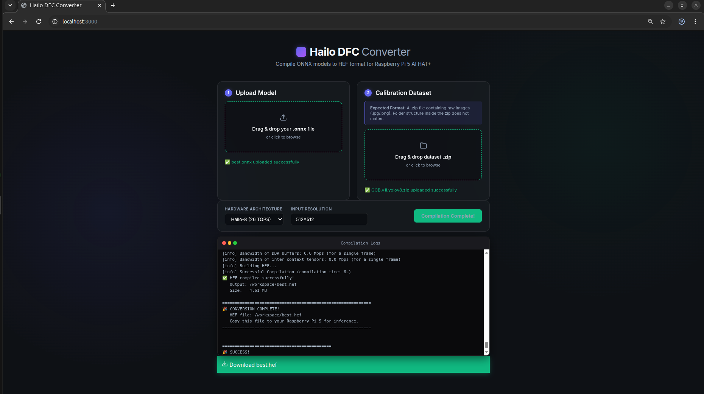

# Hailo DFC ONNX-to-HEF Converter

A sleek, lightweight web interface to compile YOLOv8 `.onnx` models into Hailo `.hef` format for the Raspberry Pi 5 AI HAT+ and other Hailo-8/Hailo-8L accelerators.



## Overview

This project provides an end-to-end pipeline to compile custom neural network models (specifically YOLOv8) for Hailo AI accelerators. Instead of fighting with Docker commands and complex Python scripts in the terminal, this repository offers a modern, glassmorphic drag-and-drop web UI to handle the entire compilation process.

The backend uses the Hailo Dataflow Compiler (DFC) via a Docker container to parse, quantize, and compile your model, streaming the live compiler logs directly to your browser via WebSockets.

## Features
- **Drag-and-Drop Interface:** Easily upload your `.onnx` model and calibration dataset `.zip`.
- **Automatic Zip Extraction:** The backend recursively searches the uploaded dataset zip for `.jpg`/`.png` files, so your internal folder structure doesn't matter.
- **Hardware Selection:** Target both **Hailo-8** (26 TOPS) and **Hailo-8L** (13 TOPS).
- **Dynamic Resolution:** Set custom input resolutions (e.g., `640x640` or `512x512`).
- **Live Terminal Logging:** Monitor the rigorous hardware mapping algorithm in real-time.
- **Auto-Cleanup:** The Docker environment is automatically spun up for compilation and destroyed upon completion.

---

## Prerequisites
1. **Docker**: You must have [Docker](https://docs.docker.com/engine/install/) installed to run the Hailo compiler.
2. **Python 3.10+**: For the FastAPI backend.

## Installation & Usage

1. **Clone the repository:**
   ```bash
   git clone https://github.com/yourusername/hailo-onnx-to-hef.git
   cd hailo-onnx-to-hef
   ```

2. **Set up the backend environment:**
   Create a virtual environment and install the minimal required dependencies.
   ```bash
   python3 -m venv venv
   source venv/bin/activate
   pip install -r requirements.txt
   ```

3. **Run the Web Application:**
   ```bash
   uvicorn app:app --host 0.0.0.0 --port 8000
   ```

4. **Access the Interface:**
   Open your browser and navigate to [http://localhost:8000](http://localhost:8000).

5. **Compile!**
   - Drop your `best.onnx` file into the upload box.
   - Drop a `.zip` file of your dataset (used for INT8 Quantization).
   - Click "Start Compilation" and wait for the final `.hef` file to download!

---

## How It Works Under The Hood
When you click compile, the backend triggers `run_conversion.sh`. This script:
1. Builds a lightweight Docker image containing the `hailo_dataflow_compiler` tools.
2. Runs `convert_onnx_to_hef.py` inside the container.
3. The script cuts the post-processing layers of YOLOv8, quantizes the weights from FP32 to INT8 using your dataset, and runs an exhaustive `optimization_level=max` mapping search.
4. Outputs the final `.hef` binary to the host machine.

> **Note on Compilation Time:** The Hailo mapping algorithm is an exhaustive mathematical search. For YOLOv8 models on `max` optimization, compilation is expected to take anywhere from **45 minutes to 2 hours** depending on your CPU. This is perfectly normal!

## Privacy
Your personal `.pt`, `.onnx`, and `.hef` files are excluded by the `.gitignore` to ensure they are not accidentally uploaded to your repository.
